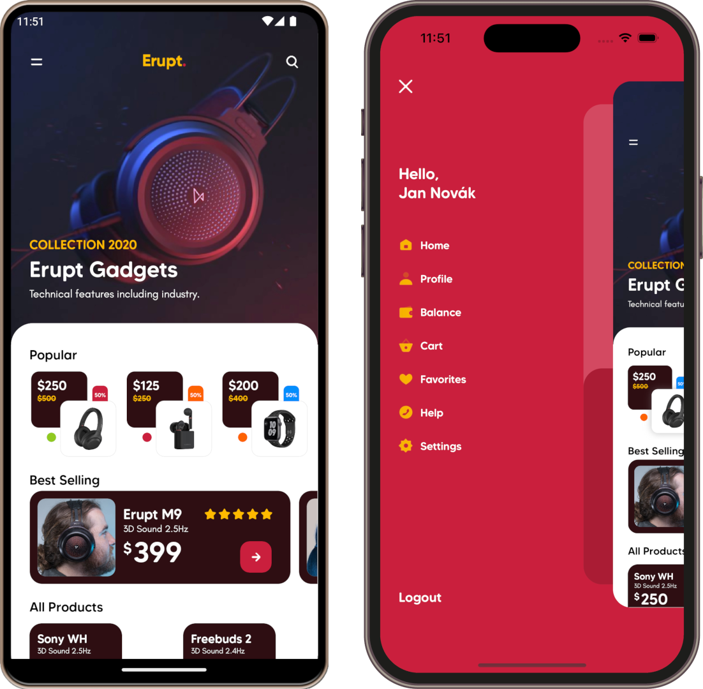
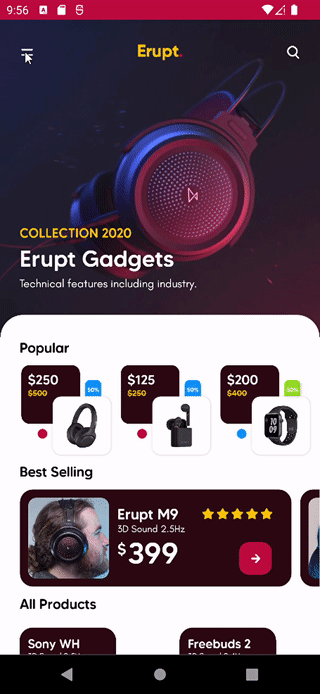
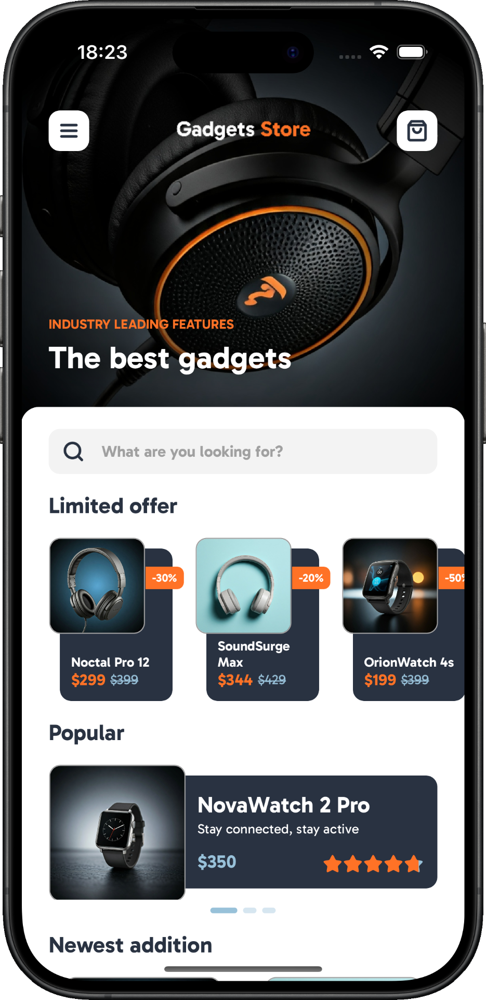
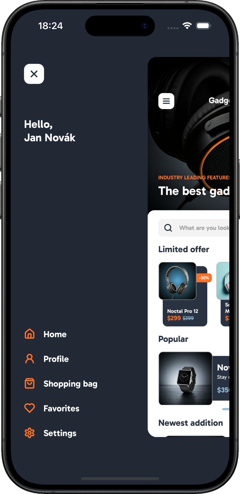
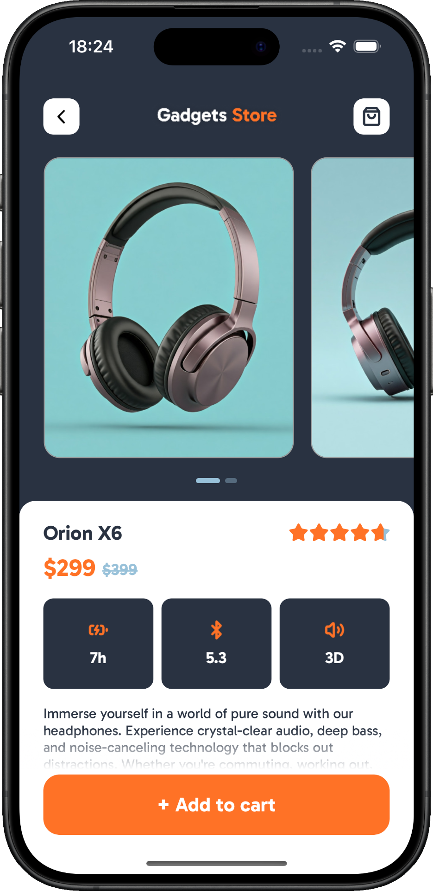

# Gadgets Store App

**.NET MAUI** implementation of [Gadgets Store App](https://dribbble.com/shots/6983164-Gadgets-Store-App) design by [Sajon](https://dribbble.com/sajon007).

## Original design

## My .NET MAUI implementation

    

The application was built using .NET MAUI APIs, and my library [SimpleToolkit](https://github.com/RadekVyM/SimpleToolkit).

### Supported platforms
These are all the platforms the app works on:

- Android
- iOS

    
    
    

    
    
    

### Features

- Use of [SimpleToolkit](https://github.com/RadekVyM/SimpleToolkit) library
    - `SimpleShell`
    - `Icon` control
    - `ContentButton`
- Reversed flyout, sliding menu... call it as you want
- MVVM architecture
- `CollectionView` and `CarouselView`
- Custom indicator view
- Use of the new .NET MAUI APIs and controls

