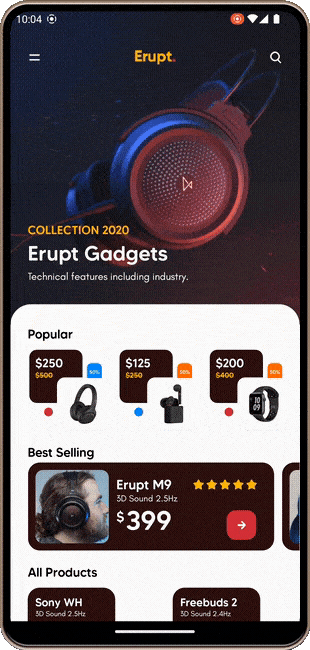
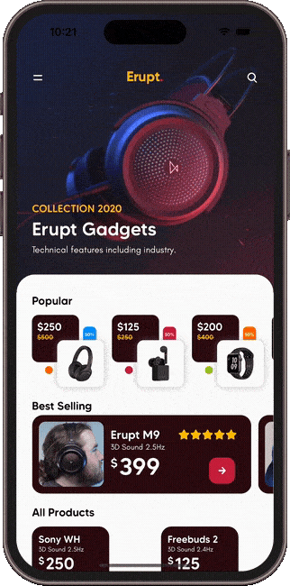

# Gadgets Store App

**.NET MAUI** implementation of [Gadgets Store App](https://dribbble.com/shots/6983164-Gadgets-Store-App) design by [Sajon](https://dribbble.com/sajon007).

This project demonstrates how to create **custom navigation menu** using `SimpleShell` control from [SimpleToolkit](https://github.com/RadekVyM/SimpleToolkit).

## Original design

## Installation

First, make sure you have your Visual Studio and .NET 7 environment set up for .NET MAUI development. If not, follow the [setup instructions](https://learn.microsoft.com/dotnet/maui/get-started/installation). Then make sure you have your [Android](https://learn.microsoft.com/dotnet/maui/get-started/first-app?pivots=devices-android) or [iOS](https://learn.microsoft.com/dotnet/maui/get-started/first-app?pivots=devices-ios) platform set up for deployment of the application.

Once everything is set up, you can clone the repo and run the application via Visual Studio.

Here are some resources to learn more about .NET MAUI:

- [Official website](https://dotnet.microsoft.com/apps/maui)
- [Microsoft Learn](https://learn.microsoft.com/dotnet/maui/what-is-maui)
- [.NET MAUI GitHub repository](https://github.com/dotnet/maui)

## Features

Only .NET MAUI APIs and my [SimpleToolkit](https://github.com/RadekVyM/SimpleToolkit) library were used to create this sample.

    
    &nbsp;&nbsp;
    

